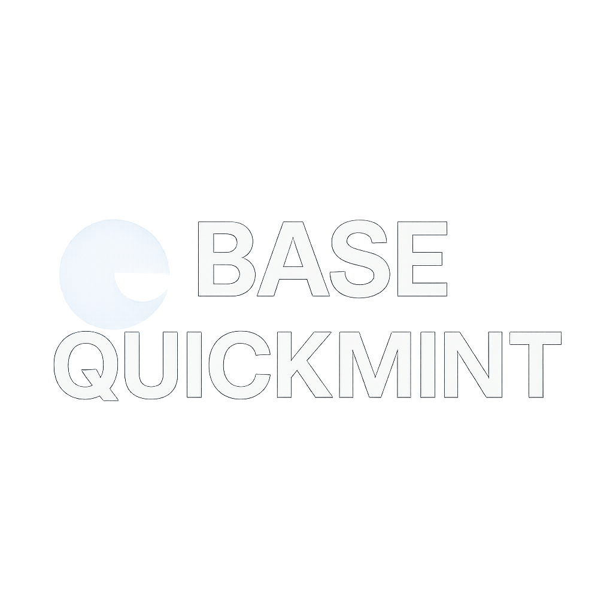

# Base QuickMint

  

## 📌 About the Project
**Base QuickMint** is a simple dApp for **NFT minting** on the **Base Sepolia Testnet**.  
It was built to make it easy to mint NFTs and demonstrate interaction with **ERC-721** smart contracts on the Base network.

### ✨ Features
- Quick NFT minting via web interface
- Compatible with Base Sepolia Testnet
- Practical example for ERC-721 contract integration

---

## 🚀 How to Use
1. Connect your wallet (MetaMask or similar) to the **Base Sepolia Testnet**.
2. Access the live site hosted via **GitHub Pages**:  
3. Click **Mint NFT** and confirm the transaction in your wallet.
4. Once the transaction is confirmed, your NFT will be visible on **BaseScan**.

---

## 🛠️ Tech Stack
- **Solidity** for smart contract development
- **Ethers.js** for blockchain interaction
- **HTML + JavaScript** for the frontend
- **GitHub Pages** for deployment

---

## 📜 License
This project is licensed under the **MIT License** - feel free to use, modify, and share it.
